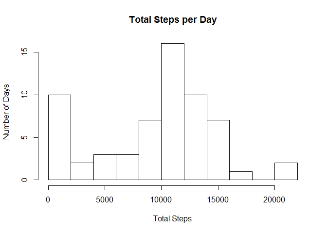
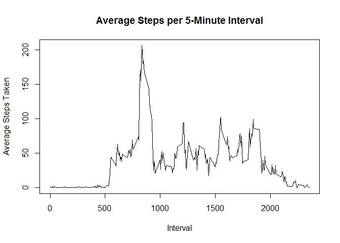
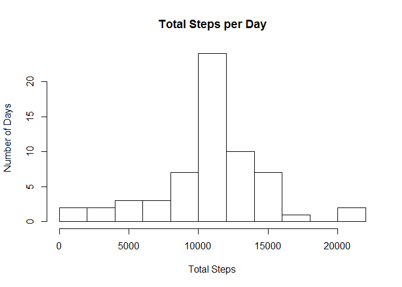
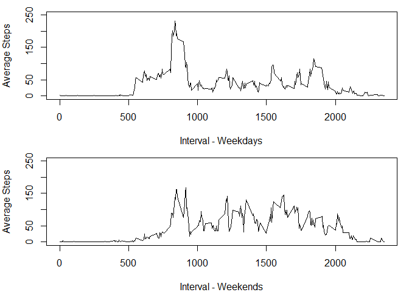

# Reproducible Research: Peer Assessment 1


## Loading and preprocessing the data
After checking to make sure the .csv file exists, read it in to a data frame.

```r
if(!"activity.csv" %in% dir()){
  if(!"activity.zip" %in% dir()){
    download.file("https://d396qusza40orc.cloudfront.net/repdata%2Fdata%2Factivity.zip","activity.zip")
  }
  unzip("activity.zip")
}
data <- read.csv("activity.csv")
```

Then take a look at the data that was just read in. 

```r
head(data)
```

```
##   steps       date interval
## 1    NA 2012-10-01        0
## 2    NA 2012-10-01        5
## 3    NA 2012-10-01       10
## 4    NA 2012-10-01       15
## 5    NA 2012-10-01       20
## 6    NA 2012-10-01       25
```

```r
summary(data)
```

```
##      steps                date          interval     
##  Min.   :  0.00   2012-10-01:  288   Min.   :   0.0  
##  1st Qu.:  0.00   2012-10-02:  288   1st Qu.: 588.8  
##  Median :  0.00   2012-10-03:  288   Median :1177.5  
##  Mean   : 37.38   2012-10-04:  288   Mean   :1177.5  
##  3rd Qu.: 12.00   2012-10-05:  288   3rd Qu.:1766.2  
##  Max.   :806.00   2012-10-06:  288   Max.   :2355.0  
##  NA's   :2304     (Other)   :15840
```

## What is mean total number of steps taken per day?
Calculate the total number of steps taken per day.

```r
spd <- tapply(data$steps,data$date,sum,na.rm = TRUE)
```

Display the sums in a histagram

```r
hist(spd,breaks=10,main="Total Steps per Day",xlab="Total Steps",ylab="Number of Days")
```

<!-- -->

Calculate the mean and median of the number of steps taken each day. 

```r
mean(spd)
```

```
## [1] 9354.23
```

```r
median(spd)
```

```
## [1] 10395
```
## What is the average daily activity pattern?
Calculate the daily activity pattern by averaging the steps value across all days for each interval

```r
dap <- tapply(data$steps,data$interval,mean,na.rm = TRUE)
```

Make a line plot of the averages

```r
plot(names(dap),dap,type='l',main="Average Steps per 5-Minute Interval",xlab="Interval",ylab="Average Steps Taken")
```

<!-- -->

Find the interval that has the maximum average.

```r
names(which(dap==max(dap)))
```

```
## [1] "835"
```
## Imputing missing values

```r
na.sum <- sum(is.na(data$steps))
na.mean <- mean(is.na(data$steps))
```
There are 2304 missing values, which represents 13.1147541 percent of the data. Make a copy of the data and for each missing value, fill in the average of that interval across all days. 

```r
cdata<-data
cdata$steps <- ifelse(is.na(cdata$steps),dap[as.character(cdata$interval)],cdata$steps)
```
Re-Calculate the total number of steps taken per day, now that missing data has been filled in. 

```r
cspd <- tapply(cdata$steps,cdata$date,sum)
```

Display the sums in a histagram

```r
hist(cspd,breaks=10,main="Total Steps per Day",xlab="Total Steps",ylab="Number of Days")
```

<!-- -->

Calculate the mean and median of the number of steps taken each day. 

```r
mean(cspd)
```

```
## [1] 10766.19
```

```r
median(cspd)
```

```
## [1] 10766.19
```

Filling in the missing data skewed the histogram towards the mean.

## Are there differences in activity patterns between weekdays and weekends?
Create a new factor variable in the completed data that distinguishes weekdays from weekends.

```r
cdata$weekday  <- as.factor(ifelse(weekdays(as.Date(as.character(cdata$date)),abbreviate=TRUE) %in% c("Sat","Sun"),"weekend","weekday"))
```
Compute the average steps taken at each interval for the weekdays and weekends.

```r
week.averages <- tapply(cdata$steps,list(cdata$weekday,cdata$interval),mean)
```
Plot these two sets of averages together. 

```r
par(mfrow=c(2,1),mar=c(4,4,1,1))
plot(names(week.averages[1,]),week.averages[1,],type='l',xlab="Interval - Weekdays",ylab="Average Steps",ylim=c(0,250))
plot(names(week.averages[2,]),week.averages[2,],type='l',xlab="Interval - Weekends",ylab="Average Steps",ylim=c(0,250))
```

<!-- -->
